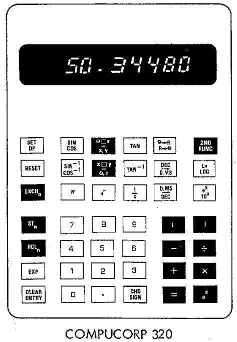

### Aihemäärittely
*Aihe*: Compucorp 320G -simulaattori, tieteellinen laskin 1970-luvulta. Simulaattorin käyttöliittymä on ulkoasua lukuun ottamatta laskinta vastaava. Lisäksi se toteuttaa kaikki laskimen toiminnot; simulaattori tukee täysin tieteellistä merkintätapaa, lukuisia trigonometrisia funktioita, logaritmeja, potensseja, juuria, sekä kulma- ja koordinaattimuunnoksia, tallennusrekistereitä ja niiden välistä aritmetiikkaa, sekä asteita ja [gooneja](https://fi.wikipedia.org/wiki/Gooni). Tarvittaessa aihetta voi laajentaa lisäämällä simulaattoriin ohjelmointitoiminnallisuuden (esim. Compucorp 322G) tai tulostustoiminnallisuuden, jossa käyttäjän syötteet muistetaan ja tulostetaan pyydettäessä tiedostoon.

*Käyttäjät*: Lauri Laskija ja Maija Maanmittaaja.

*Käyttäjien toiminnot*: 
- laskimen käynnistäminen ja sammuttaminen
- syötteen kirjoittaminen
- perusaritmetiikka (+, -, *, /, sulut...) ja funktiot (sin, cos, tan⁻¹, koordinaatistomuunnokset, log, exp...)
 - osa vaihtonäppäimen avulla
- tuloksen lukeminen
- tuloksen tallentaminen rekisteriin
- arvon hakeminen rekisteristä
- aritmetiikka rekisterien arvoilla
- kulmayksikön valinta
