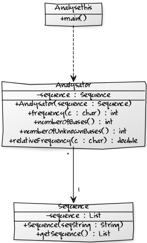
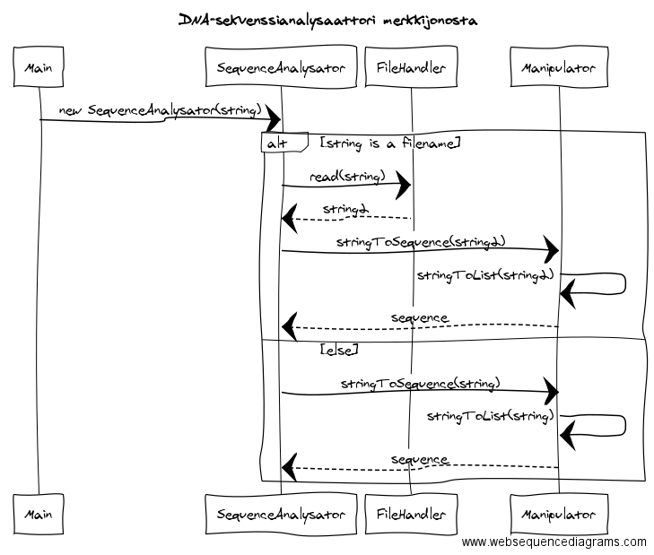
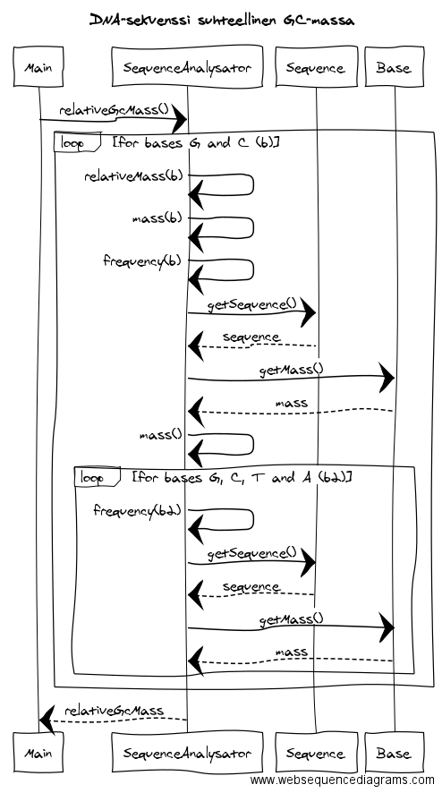
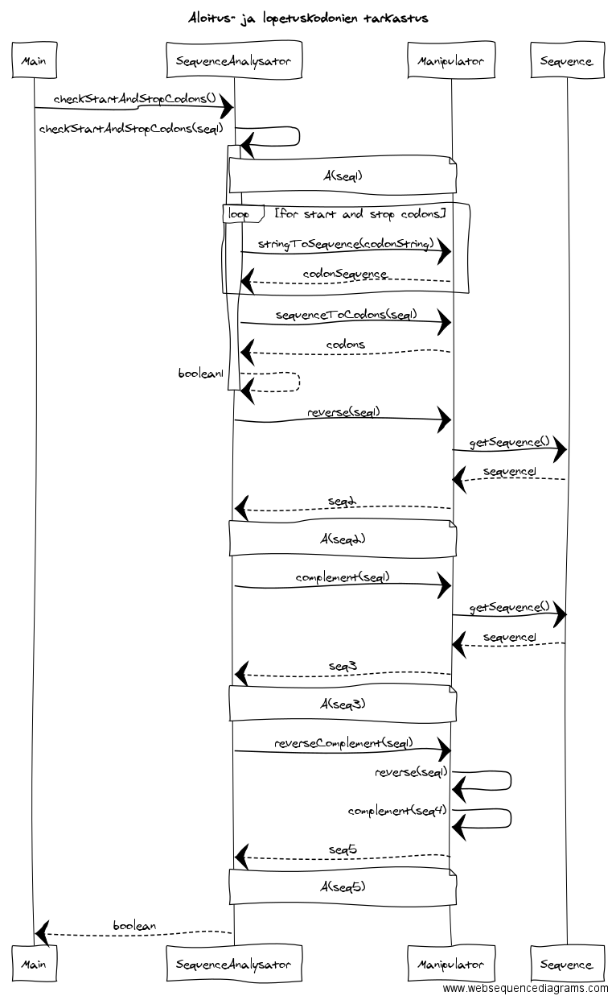

### Aihemäärittely
*Aihe*: Yksinkertainen DNA-analysaattori. Toteutetaan DNA:n analysointiohjelma, jolla käyttäjä pystyy laskemaan  (tilastollisia) tunnuslukuja syöttämällensä DNA-sekvenssille. Ohjelma tarjoaa myös mahdollisuuden kahden sekvenssin vertailuun ja analyysin tuloksen tulostamiseen.

*Käyttäjät*: Severi Sekvensoija.

*Toiminnot*: 
- analysaattorin käynnistäminen ja sammuttaminen
- DNA-sekvenssin syöttäminen
 - käsin
 - tiedostosta
 - satunnainen sekvenssi
- sekvenssin analysointi
 - emästen lukumäärä, tuntemattomat emäkset
 - frekvenssit ja suhteelliset frekvenssit
   - emäs, emäskaksikko, kodoni
 - guaniinin ja  sytosiinin suhteellinen osuus ([GC-pitoisuus](https://en.wikipedia.org/wiki/GC-content))
 - toistuvat jaksot ([toistojaksot](https://en.wikipedia.org/wiki/Repeated_sequence_(DNA)))
- kahden sekvenssin vertailu 
 - esim. [Damerau–Levenšteinin etäisyys](https://en.wikipedia.org/wiki/Damerau%E2%80%93Levenshtein_distance)
- edustaako sekvenssi ominaisuuksiltaan proteiinia koodaavaa sekvenssiä?
- sekvenssin käänteistoiston muodostaminen / muokkaaminen
- analyysin tuloksen
 - lukeminen
 - tulostaminen tiedostoon

*Määrittelyvaiheen luokkakaavio*: Luokkakaavioon on merkitty järjestelmän tärkeimmät luokat. Käyttöliittymä on tässä merkitty yhdeksi luokaksi.

*Käyttötapauksien sekvenssikaavioita*

