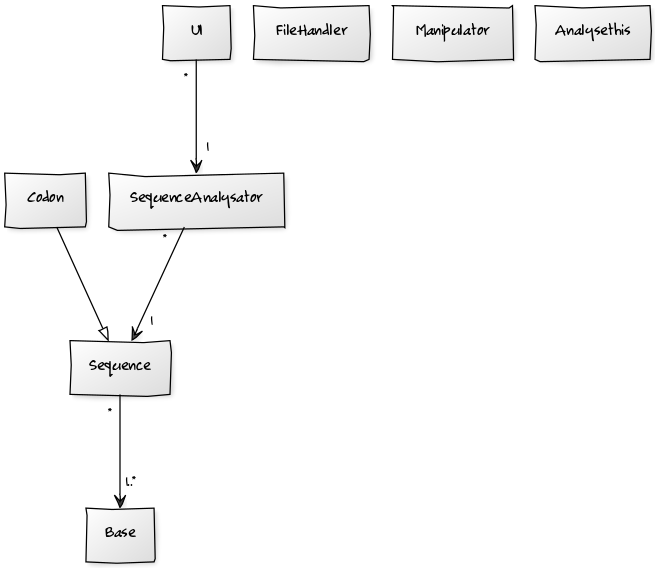

### Aihemäärittely
*Aihe*: Yksinkertainen DNA-analysaattori. Toteutetaan DNA:n analysointiohjelma, jolla käyttäjä pystyy laskemaan  (tilastollisia) tunnuslukuja syöttämällensä DNA-sekvenssille. Ohjelma tarjoaa myös mahdollisuuden kahden sekvenssin vertailuun ja analyysin tuloksen tulostamiseen.

*Käyttäjät*: Severi Sekvensoija.

*Toiminnot*: 
- analysaattorin käynnistäminen ja sammuttaminen
- DNA-sekvenssin syöttäminen
 - käsin
 - tiedostosta
 - satunnainen sekvenssi
- sekvenssin analysointi
 - emästen lukumäärä, tuntemattomat emäkset
 - frekvenssit ja suhteelliset frekvenssit
 - guaniinin ja  sytosiinin suhteellinen osuus ([GC-pitoisuus](https://en.wikipedia.org/wiki/GC-content))
 - edustaako sekvenssi ominaisuuksiltaan proteiinia koodaavaa sekvenssiä?
- kahden sekvenssin vertailu 
 - [Levenšteinin etäisyys](https://en.wikipedia.org/wiki/Levenshtein_distance)
- sekvenssin käänteistoiston muodostaminen / muokkaaminen
- analyysin tuloksen
 - lukeminen
 - tulostaminen tiedostoon

*Jatkokehitys*:
- sekvenssin analysointi
 - toistuvat jaksot ([toistojaksot](https://en.wikipedia.org/wiki/Repeated_sequence_(DNA)))
- kahden sekvenssin vertailu 
 - [Damerau–Levenšteinin etäisyys](https://en.wikipedia.org/wiki/Damerau%E2%80%93Levenshtein_distance)
- aloitus- ja lopetuskodonien tunnistaminen sekvenssin sisältä
- analyysin tehokkuuden parantaminen tai ainakin virheilmoitus ylivuodosta

### Rakenne

*Luokkakaavio*: Luokkakaavioon on merkitty järjestelmän tärkeimmät luokat.

*Rakennekuvaus*: DNA:n perusyksikkö on emäs (`Base`). Erilaisia emäksiä on äärellinen määrä, joten literaalitoteutus on perusteltu. DNA-sekvenssit (`Sequence`) koostuvat yhdestä tai useammasta emäksestä; luokalla on oliomuuttujana lista emäksiä. Oleellista on, että emäkset on tallennettu järjestyksen säilyttävään tietorakenteeseen. Kodoni (`Codon`) määrää DNA:n koodaaman aminohapon; tietyt kodonit toimivat geenin aloitus-, tietyt lopetuskohtana. Kodonit ovat kolmen emäksen sekvenssejä, minkä vuoksi `Codon` perii `Sequence`:n. Sekvenssin laskennallisesta analysoinnista vastaa analysaattori (`SequenceAnalysator`). Käyttöliittymän (`UI`) avulla hoidetaan analyysin tuloksen lukeminen. Edellä mainittujen lisäksi järjestelmään kuuluu kaksi apuluokkaa: `Manipulator` ja `FileHandler`. Ensimmäinen vastaa sekvenssien manipuloinnista ja käännöksistä tietomuodosta toiseen. Luokka ei muuta sen metodeille muutujana annettujen olioiden tilaa. Jälkimmäinen hoitaa tiedoston lukemisen ja tiedostoon kirjoittamisen.

*Käyttötapauksien sekvenssikaavioita*

