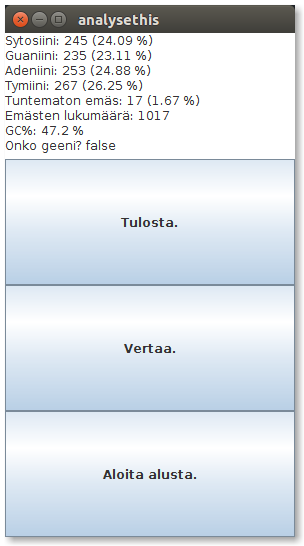

### Käyttöohjeet

*DNA-sekvenssin syöttäminen*

*analysethis*-ohjelma tukee kolmea eri tapaa syöttää DNA-sekvenssi.

1. Yksinkertaisimmillaan analysoitavan sekvenssin pystyy kirjoittamaan aloitusnäkymän tarjoamaan tekstikenttään.
2. Sekvenssin lukeminen tekstitiedostosta tapahtuu kirjoittamalla kyseisen tiedoston tiedostonimi tekstikenttään. Tiedoston tulee sijaita ohjelman juuressa ja tiedoston nimi on syötettävä muodossa *tiedostonimi.txt*.
3. Satunnaisen sekvenssin generointi onnistuu *Satunnainen sekvenssi.* -painikkeella. Kun toivottu emäsmäärä on annettu ja käyttäjä painaa *OK*, ohjelma generoi toivotunpituisen DNA-sekvenssin tekstikenttään.

*Analyysin tulos*

Ohjelman analysointitoiminnallisuus aktivoidaan aloitusnäkymän painikkeella *Analysoi!*. Huomaa, että sekvenssi tulee olla syötettynä jollakin edellä mainituista tavoista ennen analysoinnin aloittamista. Onnistunut analyysi avaa ohjelmassa uuden tulosnäkymän. Tulosnäkymässä esitetään analyysin tulos. Tuloksen pystyy tulostamaan tiedostoon näkymän *Tulosta.*-painikkeella. Tiedosto luodaan ohjelman juureen. Jo olemassa oleva samanniminen tiedosto ylikirjoitetaan. *Aloita alusta.* -painikkeella pääsee takaisin aloitusnäkymään DNA-sekvenssin syöttämiseen.

*Kahden sekvenssin vertailu*

Vertailutoiminnallisuus käynnistetään tulosnäkymän *Vertaa.*-painikkeella. Verrattavan sekvenssin pystyy syöttämään DNA-sekvenssin syöttäminen -kohdan tavoilla 1 tai 2. Käyttäjän painaessa *OK*, onnistuneen vertailun jälkeen aukeaa vertailunäkymä. Näkymässä esitetään vertailun tulos. *Takaisin.*-painike palaa takaisin tulosnäkymään.
